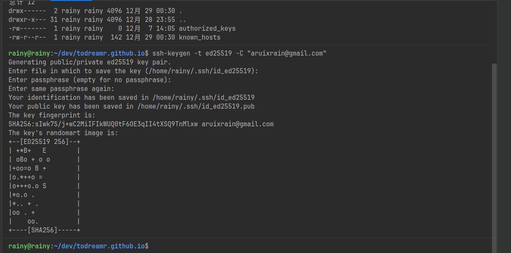

+++
title = 'Help'
date = 2024-04-30T16:17:35+08:00
draft = true
tags = ["github"]
authors= ["TuMi"]
+++

# 为 GitHub 添加 SSH

## 本地操作步骤

1. **检查本地 SSH 密钥**

```bash
ls -al ~/.ssh
```

生成密钥

```bash
ssh-keygen -t ed25519 -C "your_email@example.com"
```



2**复制公钥内容**

```bash
cat ~/.ssh/id_ed25519.pub
```

3 **配置 SSH 客户端（解决 22 端口被封问题**
```bash
vim ~/.ssh/config
```

```text
Host github.com
  Hostname ssh.github.com
  Port 443
```

4 **测试 SSH 连接**

```bash
$ ssh -T git@github.com
```

首次连接输入 yes 验证主机指纹，成功返回提示：
```text
The authenticity of host '[ssh.github.com]:443 ([198.18.0.51]:443)' can't be established.
ED25519 key fingerprint is SHA256:+DiY3wvvV6TuJJhbpZisF/zLDA0zPMSvHdkr4UvCOqU.
This host key is known by the following other names/addresses:
    ~/.ssh/known_hosts:1: [hashed name]
Are you sure you want to continue connecting (yes/no/[fingerprint])? yes
Warning: Permanently added '[ssh.github.com]:443' (ED25519) to the list of known hosts.
Hi ToDreamr! You've successfully authenticated, but GitHub does not provide shell access.
```

GitHub 网页端添加公钥

    登录 GitHub 账户，点击右上角头像 → Settings
    在左侧菜单栏找到并点击 SSH and GPG keys
    点击右上角 New SSH key 按钮
    Title 输入框填写标识名称（例如 My Ubuntu Dev PC）
    Key type 选择 Authentication key
    将第 3 步复制的公钥内容粘贴到 Key 输入框
    点击 Add SSH key 完成添加

